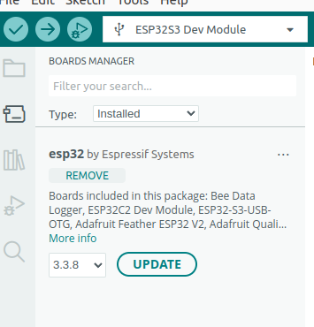
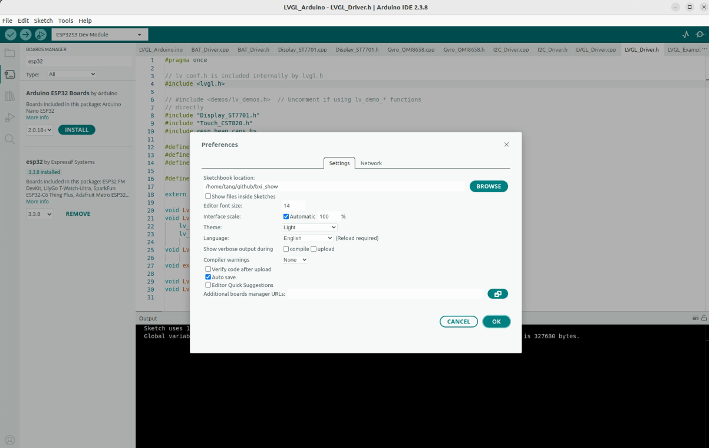
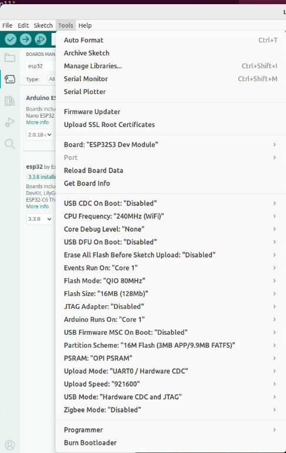

# ESP32-S3 2.1 寸触控屏演示项目

本项目基于 **ESP32-S3-Touch-LCD-2.1** 硬件平台，面向 480 x 480 圆形触控屏场景，提供一套可直接运行的客户演示工程和二次开发样例。项目已集成 LCD 显示、触摸、LVGL UI、传感器读取、无线扫描、SD 卡、电池电压、RTC 和蜂鸣器等板载能力，适合用于样机演示、客户验收和后续 UI 定制开发。

- 产品资料：[ESP32-S3-Touch-LCD-2.1 产品说明书](https://docs.waveshare.net/ESP32-S3-Touch-LCD-2.1)
- Arduino IDE 下载：[Arduino Software](https://www.arduino.cc/en/software/)

## 项目特点

- 480 x 480 RGB LCD 显示，适配 ST7701/ST7701S 屏幕驱动。
- CST820 触摸控制器，支持触摸坐标读取和基础手势识别。
- 基于 LVGL 的图形界面，包含板载参数展示、控件交互和动画演示。
- 集成 QMI8658 IMU、PCF85063 RTC、SD 卡、电池电压、蜂鸣器、背光调节等板载外设。
- 支持 Wi-Fi 与 BLE 扫描，可展示周边无线设备数量。
- 提供 Arduino 示例工程、ESP-IDF 示例工程和可直接烧录的测试固件。

## 功能演示

| 模块 | 演示内容 |
| --- | --- |
| 显示 | 480 x 480 RGB LCD 画面刷新、LVGL UI 渲染、背光控制 |
| 触摸 | CST820 触摸坐标读取、UI 控件操作 |
| UI | 参数面板、滑块、开关、动画组件 |
| 动画 | Arduino 示例入口已实现眨眼动画场景 |
| RTC | PCF85063 时间读取与显示 |
| IMU | QMI8658 加速度/姿态数据读取 |
| 存储 | SD 卡容量检测 |
| 电源 | 电池电压读取 |
| 无线 | Wi-Fi 扫描数量、BLE 扫描数量统计 |
| 交互 | 蜂鸣器开关、背光亮度调节 |

## 目录说明

```text
.
├── README.md
├── img/                              # README 操作截图
├── libraries/
│   ├── lv_conf.h
│   └── lvgl/                         # Arduino/LVGL 8.3.10 依赖库
└── ESP32-S3-Touch-LCD-2.1-Demo/
    ├── ReadMe.txt                     # 原厂目录说明
    ├── Firmware/
    │   └── ESP32-S3-Touch-LCD-2.1.bin # 可直接烧录的测试固件
    ├── Arduino/
    │   ├── examples/LVGL_Arduino/     # Arduino 示例工程
    │   └── libraries/lvgl/            # Arduino 环境使用的 LVGL 8.3.10
    └── ESP-IDF/
        └── ESP32-S3-Touch-LCD-2.1-Test/
            ├── main/                  # ESP-IDF 驱动与 UI 示例源码
            ├── components/lvgl__lvgl/ # ESP-IDF 示例内置 LVGL 组件
            └── sdkconfig.defaults
```

## 快速使用

### Arduino 编译上传

适合快速修改 UI、验证交互效果或演示动画。

1. 安装 Arduino IDE。

   Linux 环境如遇 AppImage 无法启动，可先安装 `libfuse2`：

   ```bash
   sudo apt update
   sudo apt install libfuse2
   ```

2. 使用 Arduino IDE 打开示例工程：

   ```text
   ESP32-S3-Touch-LCD-2.1-Demo/Arduino/examples/LVGL_Arduino/LVGL_Arduino.ino
   ```

3. 下载并配置所需库文件。

   

4. 设置 Arduino 项目路径。

   

5. 选择 ESP32-S3 对应开发板配置，并确认开启 PSRAM。

   

6. 编译并上传。烧录完成后，设备会启动屏幕、触摸、板载外设和 LVGL 动画示例。

## 二次开发入口

- Arduino UI/动画入口：

  ```text
  ESP32-S3-Touch-LCD-2.1-Demo/Arduino/examples/LVGL_Arduino/LVGL_Arduino.ino
  ESP32-S3-Touch-LCD-2.1-Demo/Arduino/examples/LVGL_Arduino/LVGL_Example.cpp
  ```

- ESP-IDF 主流程入口：

  ```text
  ESP32-S3-Touch-LCD-2.1-Demo/ESP-IDF/ESP32-S3-Touch-LCD-2.1-Test/main/main.c
  ```

- LCD、触摸、I2C、RTC、IMU、SD、无线等驱动位于：

  ```text
  ESP32-S3-Touch-LCD-2.1-Demo/ESP-IDF/ESP32-S3-Touch-LCD-2.1-Test/main/
  ```

## 注意事项

- Arduino 侧建议使用 LVGL 8.3.10，仓库已附带对应版本。
- ESP32-S3 运行 RGB LCD 和 LVGL 时需要开启 PSRAM。
- 如果首次编译成功，后续调试中出现异常编译失败，可参考原厂说明重新解压干净工程后再编译。
- 量产前请结合实际硬件批次、屏幕参数、供电方式和产品 UI 需求进行完整验证。

