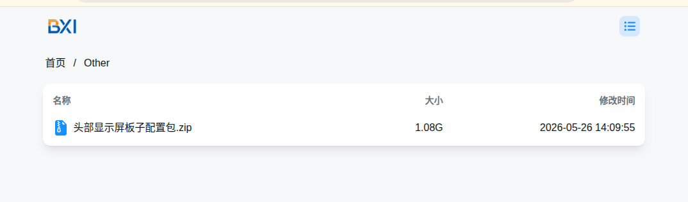
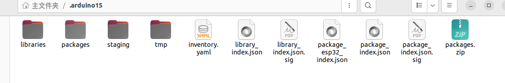

# ESP32-S3 2.1 寸触控屏演示项目

本仓库基于 **ESP32-S3-Touch-LCD-2.1** 硬件平台，面向 480 x 480 圆形触控屏场景，提供可直接演示、编译和二次开发的示例工程。项目已集成 LCD 显示、触摸、LVGL UI、传感器读取、无线扫描、SD 卡、电池电压、RTC 和蜂鸣器等板载能力，适合用于样机演示、客户验收和 UI 定制开发。

- 产品资料：[ESP32-S3-Touch-LCD-2.1 产品说明书](https://docs.waveshare.net/ESP32-S3-Touch-LCD-2.1)
- Arduino IDE 下载：[Arduino Software](https://www.arduino.cc/en/software/)

## 项目亮点

- 适配 480 x 480 RGB LCD 圆屏，使用 ST7701/ST7701S 显示驱动。
- 支持 CST820 触摸控制器，可读取触摸坐标并操作 LVGL 控件。
- 内置 LVGL 图形界面示例，包含参数展示、滑块、开关和动画演示。
- 集成 QMI8658 IMU、PCF85063 RTC、SD 卡、电池电压、蜂鸣器、背光调节等板载外设示例。
- 支持 Wi-Fi 与 BLE 扫描，可展示周边无线设备数量。
- 同时提供 Arduino 示例、ESP-IDF 示例和可直接烧录的测试固件。

## 功能演示

| 模块 | 演示内容 |
| --- | --- |
| 显示 | 480 x 480 RGB LCD 画面刷新、LVGL UI 渲染、背光控制 |
| 触摸 | CST820 触摸坐标读取、UI 控件操作 |
| UI | 参数面板、滑块、开关、动画组件 |
| 动画 | Arduino 示例入口已实现眨眼动画场景 |
| RTC | PCF85063 时间读取与显示 |
| IMU | QMI8658 加速度/姿态数据读取 |
| 存储 | SD 卡容量检测 |
| 电源 | 电池电压读取 |
| 无线 | Wi-Fi 扫描数量、BLE 扫描数量统计 |
| 交互 | 蜂鸣器开关、背光亮度调节 |

## 目录结构

```text
.
├── README.md
├── img/                              # README 操作截图
├── libraries/
│   ├── lv_conf.h
│   └── lvgl/                         # Arduino/LVGL 8.3.10 依赖库
└── ESP32-S3-Touch-LCD-2.1-Demo/
    ├── ReadMe.txt                    # 原厂目录说明
    ├── Firmware/
    │   └── ESP32-S3-Touch-LCD-2.1.bin # 可直接烧录的测试固件
    ├── Arduino/
    │   ├── examples/LVGL_Arduino/    # Arduino 示例工程
    │   └── libraries/lvgl/           # Arduino 环境使用的 LVGL 8.3.10
    └── ESP-IDF/
        └── ESP32-S3-Touch-LCD-2.1-Test/
            ├── main/                 # ESP-IDF 驱动与 UI 示例源码
            ├── components/lvgl__lvgl/ # ESP-IDF 示例内置 LVGL 组件
            └── sdkconfig.defaults
```

## 快速开始

推荐优先使用 Arduino 示例完成首次验证。如果只需要确认硬件是否正常，可以直接烧录 `Firmware/` 下的测试固件。

### 方式一：使用离线静态包（推荐）

离线包已包含屏幕示例需要的 Arduino 依赖，适合网络环境不稳定或首次部署的场景。

```text
链接：https://pan.baidu.com/s/171Z3wjyjw1CvXMiicchBWg?pwd=1234
提取码：1234
```

下载并解压后，按实际系统用户修改 Arduino IDE 配置文件：

```bash
nano ~/.arduinoIDE/arduino-cli.yaml
```

将 `directories` 配置指向当前用户的 Arduino 数据目录和工程目录。例如原配置为：

```yaml
directories:
  data: /home/tang/.arduino15
  user: /home/tang/Arduino
```

如果目标环境用户名为 `bxi`，可改为：

```yaml
directories:
  data: /home/bxi/.arduino15
  user: /home/bxi/Arduino
```

保存后重新启动 Arduino IDE，即可使用离线包内置的开发板与依赖库继续后续配置。

### 方式二：Arduino 编译上传

适合快速修改 UI、验证交互效果或演示动画。

1. 安装 Arduino IDE。

   Linux 环境如遇 AppImage 无法启动，可先安装 `libfuse2`。如果缺少串口依赖，可安装 `pyserial`：

   ```bash
   sudo apt update
   sudo apt install libfuse2
   pip install pyserial
   ```

   如果 Arduino IDE 启动异常，建议先关闭代理并清空相关代理环境变量后再启动。

2. 使用 Arduino IDE 打开示例工程：

   ```text
   ESP32-S3-Touch-LCD-2.1-Demo/Arduino/examples/LVGL_Arduino/LVGL_Arduino.ino
   ```

3. 配置 Arduino 库文件。

   

   如果在线下载较慢，可从以下地址下载离线依赖包：

   ```text
   https://download.bxirobotics.cn/
   ```

   下载完成后解压，并将对应库文件替换到 Arduino 项目依赖目录。

   

   

4. 设置 Arduino 项目路径。

   

5. 选择 ESP32-S3 对应开发板配置，并确认开启 PSRAM。

   

6. 编译并上传。

   烧录完成后，设备会启动屏幕、触摸、板载外设和 LVGL 动画示例。

### 方式三：直接烧录测试固件

适合快速验证硬件和出厂演示效果。

```text
ESP32-S3-Touch-LCD-2.1-Demo/Firmware/ESP32-S3-Touch-LCD-2.1.bin
```

使用原厂烧录工具烧录时，烧录地址为 `0x00`，并确认已勾选对应固件条目。

## 二次开发入口

### Arduino 入口

```text
ESP32-S3-Touch-LCD-2.1-Demo/Arduino/examples/LVGL_Arduino/LVGL_Arduino.ino
ESP32-S3-Touch-LCD-2.1-Demo/Arduino/examples/LVGL_Arduino/LVGL_Example.cpp
```

### ESP-IDF 入口

```text
ESP32-S3-Touch-LCD-2.1-Demo/ESP-IDF/ESP32-S3-Touch-LCD-2.1-Test/main/main.c
```

LCD、触摸、I2C、RTC、IMU、SD、无线等驱动位于：

```text
ESP32-S3-Touch-LCD-2.1-Demo/ESP-IDF/ESP32-S3-Touch-LCD-2.1-Test/main/
```

使用 VS Code 或 ESP-IDF 环境打开工程时，请选择具体工程目录：

```text
ESP32-S3-Touch-LCD-2.1-Demo/ESP-IDF/ESP32-S3-Touch-LCD-2.1-Test/
```

不要只选择到上一级 `ESP-IDF/` 目录。

## 常见问题

### Arduino IDE 启动失败

- Linux AppImage 启动失败时，先确认是否安装 `libfuse2`。
- 如果 IDE 长时间卡在启动或下载阶段，先关闭代理，并清空 `HTTP_PROXY`、`HTTPS_PROXY` 等代理环境变量后重试。

### 编译失败或依赖异常

- Arduino 侧建议使用仓库附带的 LVGL 8.3.10。
- 如果首次编译成功，但后续调试中出现异常编译失败，可参考原厂说明重新解压一份干净工程后再编译。
- 网络下载依赖不稳定时，优先使用离线静态包或 `https://download.bxirobotics.cn/` 提供的依赖包。

### 上传后屏幕无显示

- 确认选择的是 ESP32-S3 对应开发板配置。
- 确认 PSRAM 已开启。
- 确认固件或工程与 `ESP32-S3-Touch-LCD-2.1` 硬件型号匹配。

## 备注

本仓库同时保留原厂 Arduino、ESP-IDF 和 Firmware 目录。若只做 UI 和交互演示，优先修改 Arduino 示例；若需要深入调整底层驱动或系统配置，再进入 ESP-IDF 示例工程。
